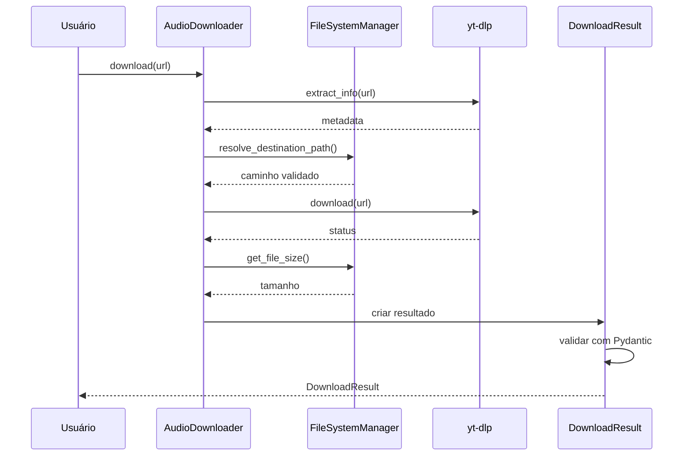

# YouTube-Audio-Downloader

[](https://www.python.org/downloads/)
[](https://github.com/yt-dlp/yt-dlp)

Sistema para download de áudio via yt-dlp com gerenciamento de configurações e sistema de arquivos.

## Instalação

```bash
pip install git+https://github.com/AndreKoraleski/YouTube-Audio-Downloader.git
```

## Início Rápido

```python
from downloader import AudioDownloader

downloader = AudioDownloader()
result = downloader.download("https://www.youtube.com/watch?v=dQw4w9WgXcQ")

if result.success:
    print(f"Arquivo salvo em: {result.file_path}")
else:
    print(f"Erro: {result.error_message}")
```

## Fluxo de Download



## Configuração

### Parâmetros Disponíveis

#### Salvamento

| Parâmetro | Tipo | Padrão | Descrição |
|-----------|------|--------|-----------|
| `output_directory` | `str` | `"downloads"` | Diretório de destino dos arquivos |
| `filename` | `Literal["title", "id"]` | `"title"` | Esquema de nomenclatura |
| `overwrite_existing` | `bool` | `False` | Sobrescrever arquivos existentes |
| `create_subdirectories` | `bool` | `True` | Criar subdiretórios por vídeo |
| `create_result_file` | `bool` | `True` | Gerar arquivo JSON com metadados |

#### Seleção de Stream

| Parâmetro | Tipo | Padrão | Descrição |
|-----------|------|--------|-----------|
| `audio_quality` | `Literal["best", "balanced", "worst"]` | `"best"` | Qualidade do áudio |
| `preferred_codec` | `Literal["opus", "aac"]` ou `None` | `"opus"` | Codec preferencial |

#### Robustez

| Parâmetro | Tipo | Padrão | Descrição |
|-----------|------|--------|-----------|
| `retries` | `int` | `3` | Número de tentativas |
| `timeout_seconds` | `int` | `30` | Timeout por tentativa |

### Exemplo de Configuração

```python
from downloader import AudioDownloader, DownloaderConfig

config = DownloaderConfig(
    output_directory="audios",
    filename="id",
    overwrite_existing=True,
    create_subdirectories=False,
    audio_quality="balanced",
    preferred_codec="opus",
    retries=5,
    timeout_seconds=60
)

downloader = AudioDownloader(config)
result = downloader.download("https://www.youtube.com/watch?v=VIDEO_ID")
```

## Estrutura do Projeto

```
yt-downloader/
├── src/
│   └── downloader/
│       ├── __init__.py
│       ├── config.py           # Configurações
│       ├── engine.py           # Lógica principal
│       ├── filesystem.py       # Gerenciamento de arquivos
│       ├── options.py          # Opções yt-dlp
│       └── result.py           # Modelo de resultado
├── example.py
├── pyproject.toml
└── README.md
```

## DownloadResult

```python
@dataclass
class DownloadResult:
    success: bool
    video_id: str
    title: str
    file_path: Path | None
    error_message: str | None
    duration_seconds: int | None
    file_size_bytes: int | None
    uploader: str | None
    upload_date: str | None
```